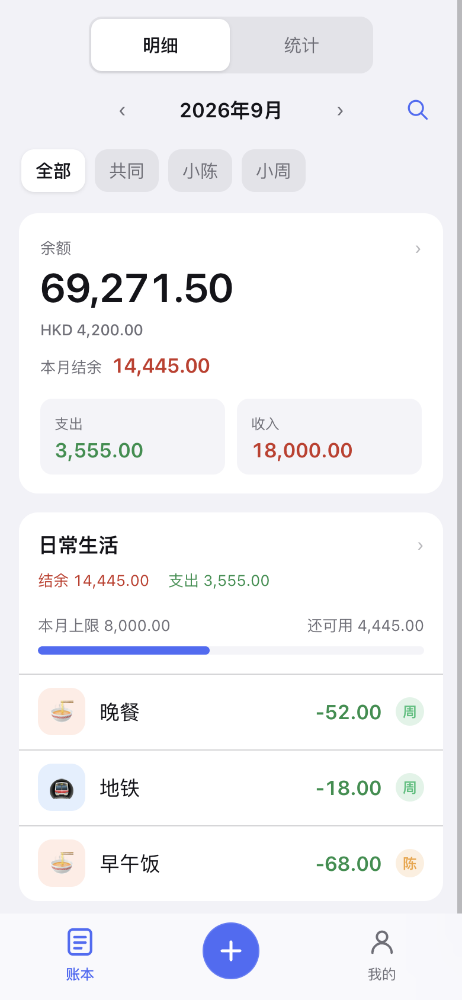
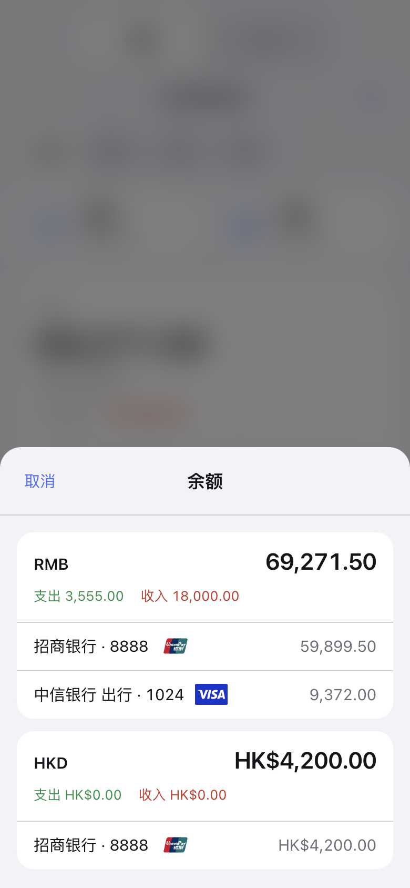
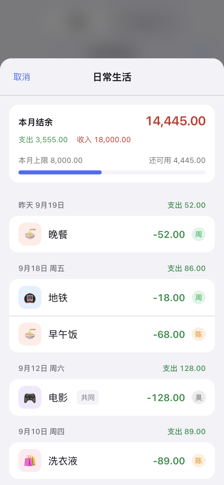
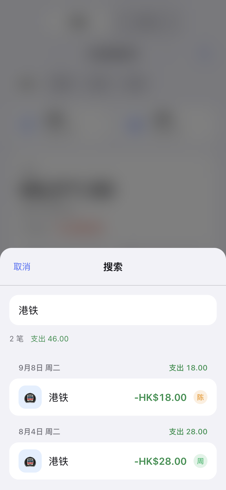
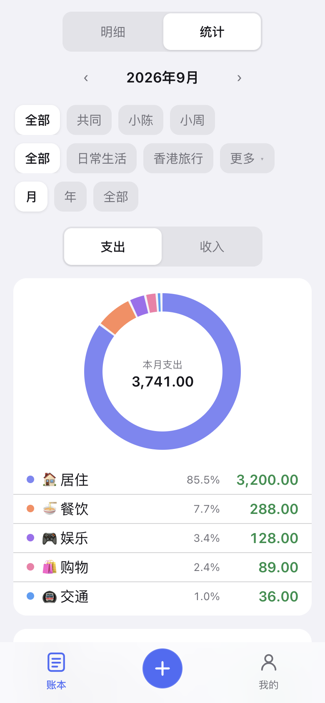
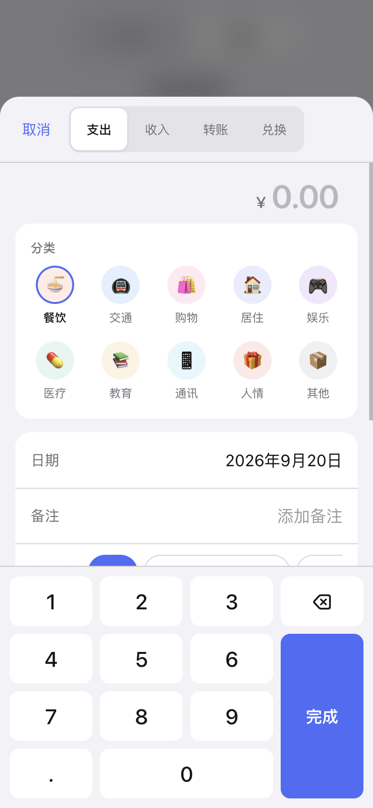
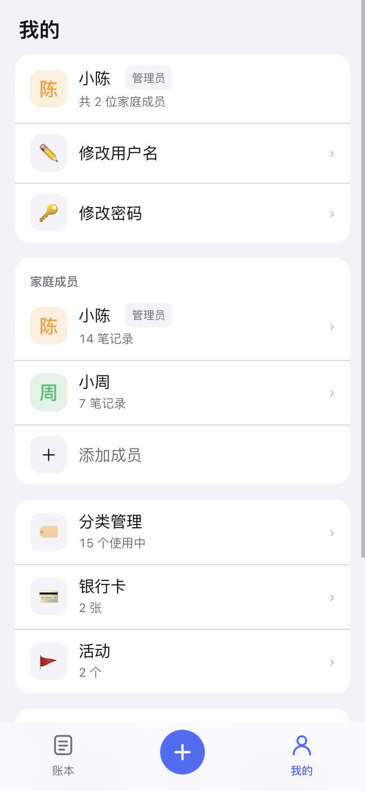
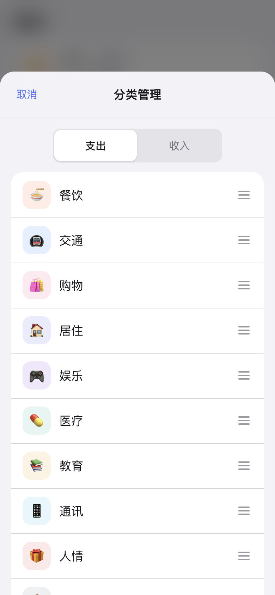
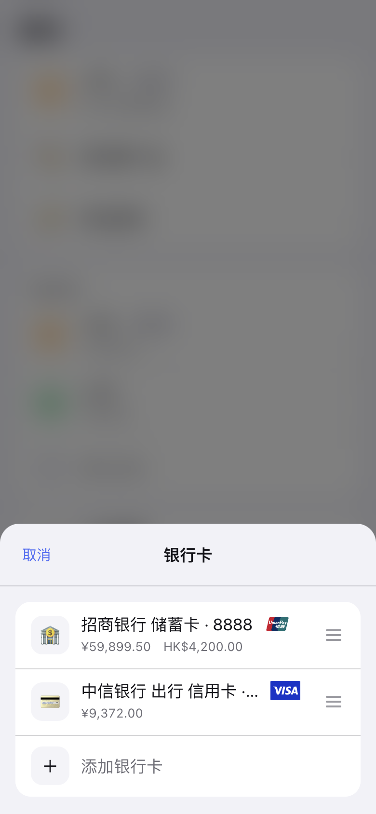
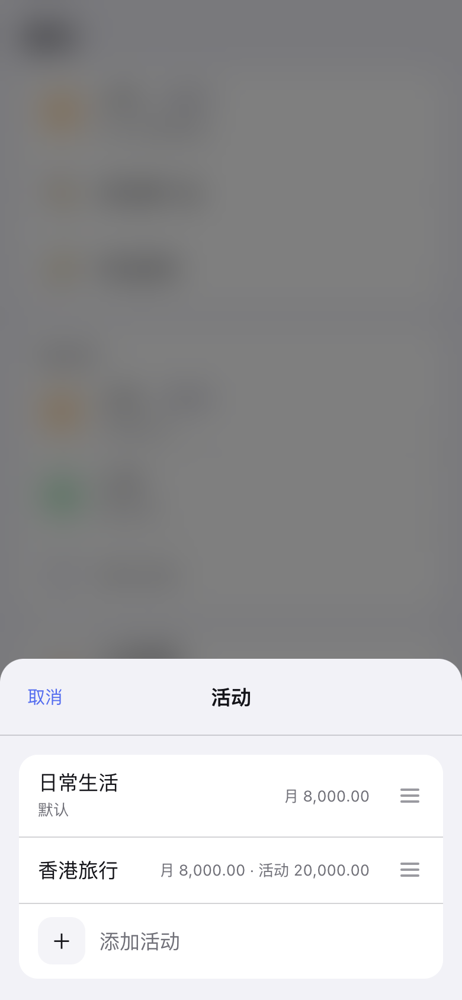

# 记账

同一地址登录，各看各的账。注册就开一本新账；一本账里仍可邀请家人、记共同账。分类和活动都能改，银行卡按币种记，短信或照片也能自动入账。

- 多用户：不同账本互不可见。一本账里每笔能看出是谁记的，也可以记入共同账。管理员管成员和密码。
- 灵活分类：分类可改图标、颜色、归档和顺序；支出和收入挂在活动上。
- 支持多国银行卡：按币种记余额，银联、Visa、Mastercard、运通都能用。
- AI 自动识别：粘贴银行短信或拍一张单，图里有几笔就记几笔，分类、活动和卡按各笔自己选；结售汇先兑换再转到收款卡。

在 iPhone 上用 Safari 打开账本，点底部分享，再点「添加到主屏幕」。之后从桌面图标进去，没有浏览器地址栏，底栏就是账本和记一笔，少绕一层。

界面按手机设计。页面不加载任何外部资源；不配识别密钥时，完全离线也能用。

## 界面

账本首页是余额和这个月的活动。配了识别密钥后，上面还会出现短信和识图。

<p align="center"></p>

配了识别密钥后，账本上会出现「短信」和「识图」。

<p align="center"></p>

点开余额，按币种看每张卡还剩多少。

<p align="center"></p>

点开活动，能看结余、上限和最近几笔，点进去就能改。

<p align="center"></p>

右上角可以按备注搜索全部时间的账。

<p align="center"></p>

统计按账本、活动和时间筛选，有分类环和银行汇总。

<p align="center"></p>

记一笔用自定义数字键盘。支出和收入挂活动，转账和兑换不算收支。

<p align="center"></p>

「我的」里管自己、家庭成员，以及分类、银行卡和活动。

<p align="center"></p>

分类可以改图标和颜色，也能拖顺序。

<p align="center"></p>

银行卡按币种记余额。

<p align="center"></p>

活动可以设每月上限和整个活动的上限。上限看全家支出，不按账本拆分。

<p align="center"></p>

## 使用

本机需要 Go 1.27。

```
make demo
```

会写入两名演示成员和几个月的模拟账单，然后启动。登录是 `小陈` / `demodemo`，另一位是 `小周` / `demodemo`。空库启动用 `make run`。

演示默认不打开识别。自己跑的时候加上识别密钥，账本上就会出现「短信」和「识图」。

## 自己跑

一个 Go 程序，网页和 SQLite 都打在二进制里，监听一个端口就能用。配置都走环境变量，服务器上放在 `/etc/ledger/env`。

| 变量 | 默认 | 说明 |
| --- | --- | --- |
| `LEDGER_ADDR` | `:18080` | 监听地址 |
| `LEDGER_DATA` | `LEDGER_DB` 所在目录 | 账号目录和新建账本的存放位置 |
| `LEDGER_DB` | `ledger.db` | 若该文件已存在，启动时导入为一本账 |
| `LEDGER_IMPORT` | 无 | 额外要导入的旧库，逗号分隔 |
| `LEDGER_SIGNUP` | 开放 | 设为 `0` 则关掉公开注册 |
| `LEDGER_ADMIN_USER` | `admin` | 还没有任何账号时，第一本账的管理员 |
| `LEDGER_ADMIN_PASSWORD` | 无 | 第一本账的管理员密码，至少 8 位 |
| `LEDGER_SECRET` | 无 | 会话签名密钥，至少 16 个字符 |
| `LEDGER_TLS_CERT` / `LEDGER_TLS_KEY` | 无 | 成对填写才启用 HTTPS |
| `LEDGER_DEEPSEEK_KEY` | 无 | 识别密钥；留空则不出现入口 |
| `LEDGER_DEEPSEEK_URL` | `https://api.deepseek.com` | 识别接口地址 |

用户名全站唯一。管理员密码只在还没有任何账号时用来开第一本账；之后忽略。密钥留空会每次随机，重启后要重新登录。识别密钥只留在服务器上，只有成员主动点「短信」或「识图」才会把这段内容连同分类、活动、银行卡和近期账目发出去。图里有几笔就记几笔；对不上的分类记到「其他」，活动看不出则记到默认活动，卡看不出则不绑卡。结售汇或跨境汇款记成汇出卡上的兑换，再转到收款卡；两张卡对不上则这两笔都不记。登录页开放注册时，可以自己开一本账。

放到服务器上，仓库里有 Debian 13 的安装脚本，以及从本机编译推送的脚本。配好 SSH 别名后，先跑一次 `deploy/server/provision.sh`，之后更新再跑 `deploy/deploy.sh your-server`。两个脚本都可以重复执行，安装脚本不会覆盖已有的配置、证书和数据库。

账号目录和每本账都在数据目录里。开了 WAL，复制前先停服务；也可以在「我的」里导出 CSV。

```
systemctl stop ledger
cp -a /var/lib/ledger ~/ledger-$(date +%F)
systemctl start ledger
```

`make test` 跑检查，`make build-linux` 交叉编译。

## 许可

MIT

## AI 使用声明

目前是 Vibe Coding 项目。仓库全部由 Cursor Grok 4.6 + Cursor Harness 生成。
